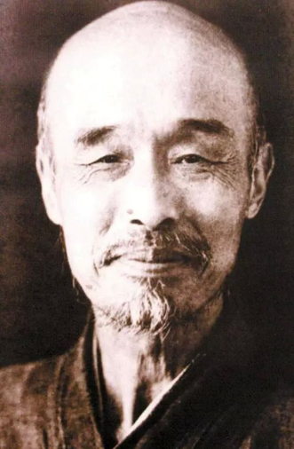

# 稻盛和夫

早在本科思政课就被推荐稻盛和夫的《干法》和《活法》，当时也没怎么在意，只觉得其理念挺好，和一般的鸡汤差不多。现在为什么重新省视呢？因为不久之后将会重新进入职场，很有可能在日后会管理团队，如何让大家同心协力，平衡各方诉求，是一件挺难的事情。

稻盛和夫是著名企业家，但我感觉他更像是哲学实践家，将自己的哲学理念付诸行动，在京瓷和KDDI两家公司完成出色的实验。第二个让我钦佩的是，他在65岁时选择出家，股份分给员工，“功成而弗居”，这是非常难以做到的！身居高位却没有被其束缚，试看有多少人因为高位的特权而陷入腐败。第三个佩服的地方是，78岁高龄，能激流勇进，帮助日航在一年半的时间里扭亏为盈。78岁本该是安详晚年，而且名利都完美收官，此时竟然敢接这个烂摊子，不怕毁了一世英名？

稻盛和夫真是个大自在的人，反观自己，惭愧万分啊。自从走出困境以来，得失心越来越重，每天都想着得到，想着追赶，情绪也更难控制，内心的平衡经常被打破。同样是“卷王”的稻盛和夫是如何平衡“得到”和“放下”的呢？他有几句话令我感触深刻。

### 人生的意义在于磨炼灵魂
> 稻盛和夫从来没有回避死亡，当死亡来临时，今世所有的地位、名誉、财富都得统统放弃，如果有人问我：“你为何来到这世上？”我会毫不含糊地回答：“是为了在人生谢幕之时的灵魂，比人生开幕之初更纯洁一点，或者说带着更美好、更崇高的灵魂去迎接死亡。”

对人生意义的追问是永不停息的话题，自己也曾试图找到自己的答案，18年内观之后，这个答案渐渐清晰了起来，当时的想法是，既然财富、名誉、地位是身外之物，离开后能带走什么呢？联想弘一法师离世前写的“悲欣交集”和他慈悲的面容，突然觉得，如果生命的最后能够从容面对死亡，不贪恋没得到的财富，不渴求没de完的bug，不留恋相濡以沫。在觉知中平静离去，将会是多大的超脱。

但这种状态不是在临死的瞬间转变的，而是在整个生命里磨炼的。希望自己不要迷失在攀援追求中，经常提醒自己的初心，磨炼灵魂。

### 把利他之心作为判断的基准
> 在我们每个人的心里，既有“只要对自己有利就行”的利己心，也有“即便牺牲自己，也要帮助他人”的利他心。要想把工作做得更好，在作判断时，就不能只考虑自己，还应该估计周围的人，要满怀关爱别人的“利他之心”。

工业化带来了越来越细的社会分工，不知有否这样的体会，在学校或者工作时，会感觉自己无所不能，但回到家中，却感觉自己啥也不会。精细的分工告诉我们只需要做好自己部分的工作，至于别人怎么做，不用去管。

小学时有思考过，到底自己的行为是自私还是无私，帮助别人讲解题目，是无私吗，其实我是想以后自己也有不会的，如果遮遮掩掩，以后不就会得不到帮助吗？这也是一种自私吧？那如何看待雷锋同志，德蕾莎修女的无私行为呢，不会也是自私吧？

自私和无私是否可以都归结为自私，而每个人的行为之所以不同，是因为思考的时间尺度和空间尺度不同。如果想着眼前和个人，那么就是世俗的“自私”，如果想着长远和大众，那么就是世俗的“无私”。稻盛和夫利他，反过来也成就了自己，这岂不是利己？

当遇到人生岔入口，比如职业选择时，不妨想想利他的方面，不要老想着自己的年薪有多少，能爬多高。多一个维度的思考，也许更容易拨云见日。

### 不可将个人才能私有化
> 才能某种意义上是上天赋予的，不能凭借的才能谋取私利，而应该更好的服务社会，反馈大众。

我也经常有这种错觉，自己的能力源于自己的长期的努力，因此取得的荣誉应该归功于自己，一切都是“我的、我的、我的”。因此看到别人更加优秀时，会心生嫉妒，看到更更优秀时，会心生羡慕。虽然明知道有哪里不对，但实在是没法控制这种感觉。

我也时常感到奇怪，高中那么基础的东西，为啥很多人不会？带过好多小朋友，玩得都挺开心，小聪明也一堆，为啥做题时困难重重呢？同样的，那些大神看我估计也是这种无奈吧。也行，才能这东西，确实会赋予上限，和个人无关。

阳明先生曾以金喻圣，尧舜如万镒金，孔子如千镒金，虽然量不同，但都是纯金。每个人的天赋不同，身处的时代不同，但只能决定量，但决定质的是“此心纯天理上用功”。能力越强责任越大，自己有多少能力就做多少贡献，用心精纯，方能磨炼灵魂，这就够了吧。更优秀的人有更重大的责任，很累的。

这三点已经够我学几年了，得时常提醒，千万不能在学业、职场中迷失初心，“积善成德，方得始终”。