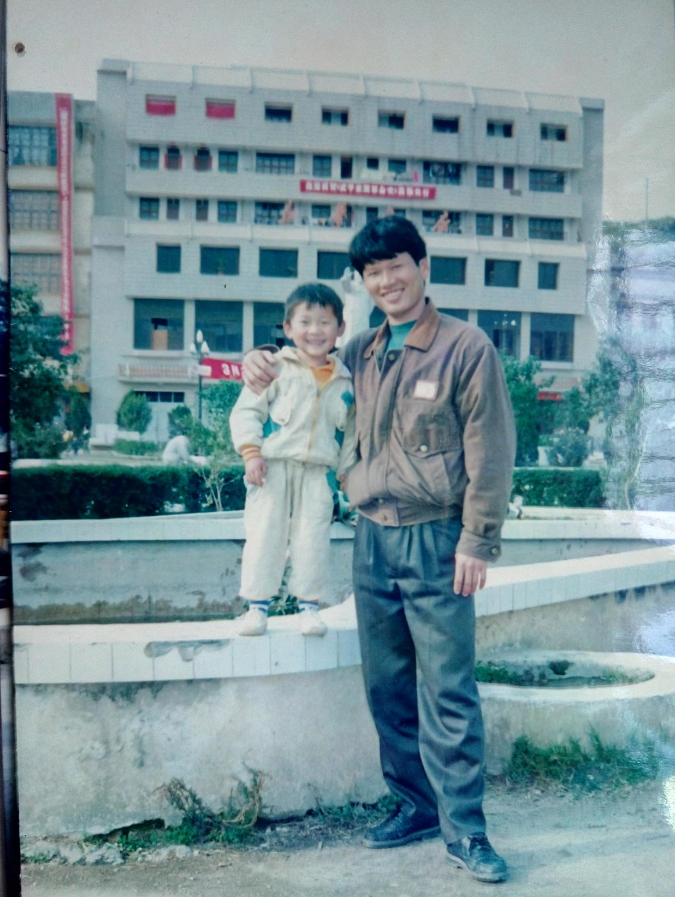

# 怀念父亲

20190616
今天是父亲节，好想问您一句：“老爸，最近可安好？”

过去的一年半来，我的境况变动挺大，半年摆脱了期货，在鸵鸟公司静养了半年，现在准备考研。很难想象您如此宽容甚至纵容我的第一次择业，现在回想起来，连我自己都感到后怕。

### 一、 桃李不言，下自成蹊

自从上初中之后，您就很少管我，从小您就对我说，“学好数理化，走遍天下都不怕！”，“数学好，物理化学肯定好。”你可曾记得小时候还陪我刷题，时不时我们还互相较劲。当碰到复杂的代数题时，您经常来一句“数学就是硬切猪，总能算出来。”用现在比较时髦的话来说就是：“答案就在那里，不增不减。”因此每当碰到难题，带着这个信仰，我首先能在精神上战胜它，“大不了用数值，大不了用计算器，大不了画图，总能算出来！”。之后看到我沉迷刷题的时候，您也就不再管我了，反而让我不要太扎实，吃饭的时候就好好吃饭。

确实很感谢您给我的宽松环境，只要完成作业，电视随我看；暑假头几天解决《暑假生活》，“小霸王”随我玩，还经常鼓励我多和小伙伴出去浪，三教九流全都得接触，没有什么高低贵贱。现在回想起来，当我寒暑假整天打游戏的时候，难道您就一点都不担心我沉迷游戏影响学习？说来也奇怪，到了初中，我对游戏就不再敢兴趣，不会是您早就预料的吧？您不是还有项技能：听名字猜外貌，看照片猜性格。老妈经常调侃说，全是瞎扯，您也只是回以狡黠一笑，得“半仙”美称，即“天上的事知道一半，地下的事全知道。”您走的半年前还展示了这项绝技，猜我未来的女朋友，哈哈哈。

直到某天下午，我才明白，您的这些“纵容”是多么不容易。那天午后，我心血来潮想练练您那辆带挡位的雅马哈摩托车，和您汇报之后，没想到床头静养的您爽快地回了句“好”，之前都是您带着练，现在竟然这么放心让我独自去浪，那我真不客气啦。于是，中远上城的大路上溜达的几圈之后，一切顺利，欣然回家。晚上吃饭的时候，您半开玩笑地告诉我，当时的那几十分钟我提心吊胆，直到我安全回来才安心。

那一刻，我才明白，父亲对我的教育承担了多大的风险，现在好多家长对小孩管得很严，企图控制他们的一举一动，美其名曰：“爱，关心”，表面上很累很辛苦，付出很多，但实际上却是最轻松的方法，所有都在自己的掌控之中，能不轻松吗？如果做个实验，试试放开监督，看着孩子有可能犯错而不能制止，这种煎熬孰难孰易？如果主动选择承担这种煎熬，又孰难孰易？父爱如山，山承受了安好岁月里的所有风险。

### 二、您的最后一课

高中之后，我对家族里面的事越来越一无所知，也没兴趣关心，当时有听过您写族谱的事，觉得也没啥特别的。真的是直到筹备您葬礼到追悼会期间，我才从兄弟族群的反馈中体会到您为家族付出的是那么多，从同事朋友的口中得知您对工作是多么尽心尽责，从叔叔姑姑的言语中感受到您这“大哥”当得是多么不容易。以前只看到你对叔叔姑姑他们指手画脚发脾气，殊不知您是真心为他们考虑，心直口快敢得罪人的才是真兄弟；以前只看到你懒洋洋地躺在床上休息，殊不知您凌晨还关心在贫困户的补助申请；以前只看到您在饭桌上板着脸不开心，殊不知您对家族工作是如此热心。现在看来，当时也只有您能够编写族谱，家族里有比您文化高的，但他们没有您对家族关系如数家珍，也有人比您清楚家族关系的，但他们多数不识字。

曾经幻想着自己的生活只需要一张纸和一支笔，不停推导数字就可以，什么人际、家庭、社会、国家、世界，在大宇宙面前都是微不足道的东西，深邃的星际图会让人放下所有的烦恼。当时我只认识到思维和理性的栖息之地，却没有认识到感受和情感的归属之处。这一课，也是您给我上的最后一课，没想到代价如此之大。

### 三、善用心者，即可以苦为乐，以祸为福

很庆幸自己有机会在您最后的日子里陪伴您，也可以算是工作以来回家最久的一次，当时还乐观地认为来日方长，以后有的是时间，还想看看您会怎么“戏弄”您的孙子。病床边陪伴的时候是很无助的，自己只能做看滴管，倒水那样的小事，看见您的日渐消瘦却无能无力，每个人都想做最好的付出，但却找不到支点帮上忙，深深地感到自己在疾病和死亡面前是多么无力。“你数学不是很牛吗，你物理不是很能推吗，你期货不是很能炒吗，你不是很能跑吗？！”所有曾经那些加光环于我的东西，都是无能为力的，我隐约觉得，自己的生命中是不是缺了某样东西，但又怎么也说不上来。

很不要脸地说，自己当时还做着征服华尔街的梦，然后做了个沙盘推演：假设我已经做到了，账户有很多钱，能请到有头有脸的人物，能找来最好的医生，甚至做肝移植。这是否可以让父亲感到更好呢？欢快地畅谈之后是更漫长的沉寂，山珍海味之后是更漫长的平淡，外在的虚荣之后是很漫长的空虚。所有外在的刺激都是短暂的，病榻上的苦痛还是只能老爸一人承担。

我甚至还设想，加入真有龙珠，并已经集齐，现在我正能够实现一个梦想，只能一个梦想，到底该许什么呢？让父亲长命百岁，到底到几岁呢？让父亲马上康复，会不会过几个月又生病呢？让父亲正常老去，怎么样才算正常呢？到那个时候不还是要面对一次死亡吗？我就这样不停地做思维攻防，企图找到一个完美地，万无一失的方案，但愿神龙多给我一些时间。

经过无数回合的斗争，我想出一个不能算是最好，但还是能接受的愿望：希望老爸面临病痛的时候不会恐惧，充满勇气和平静；希望身边看望老爸的人能更坦然面对死亡，把它看成是起点而不是终点。这看着不算是什么愿望，似乎也不需要什么神龙，现实生活也能做到，只是看人愿不愿意，而最难的也正是这“愿不愿意”？

心如狂野之兽，根本不受控制，有些甚至这一点都认识不到，被心所抑而不自知。《金刚经》有句贯穿全文的发问：

> 善男子、善女人发阿耨多罗三藐菩提心，应云何住？云何降伏其心？

也许，这就是我生命中缺少的那样东西。

时间过得真快，今天老妈发消息说：“今天是父亲节，祝你早日成为父亲！”我也到了做父亲的年龄，您在我这个时候，我已经三岁了，即将从武装部搬到新家，遥想当年，雄姿英发：

祝老爸父亲节快乐！